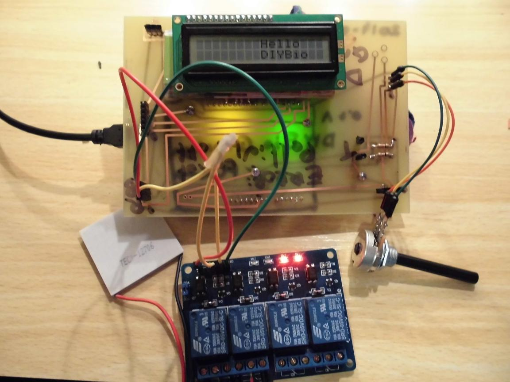
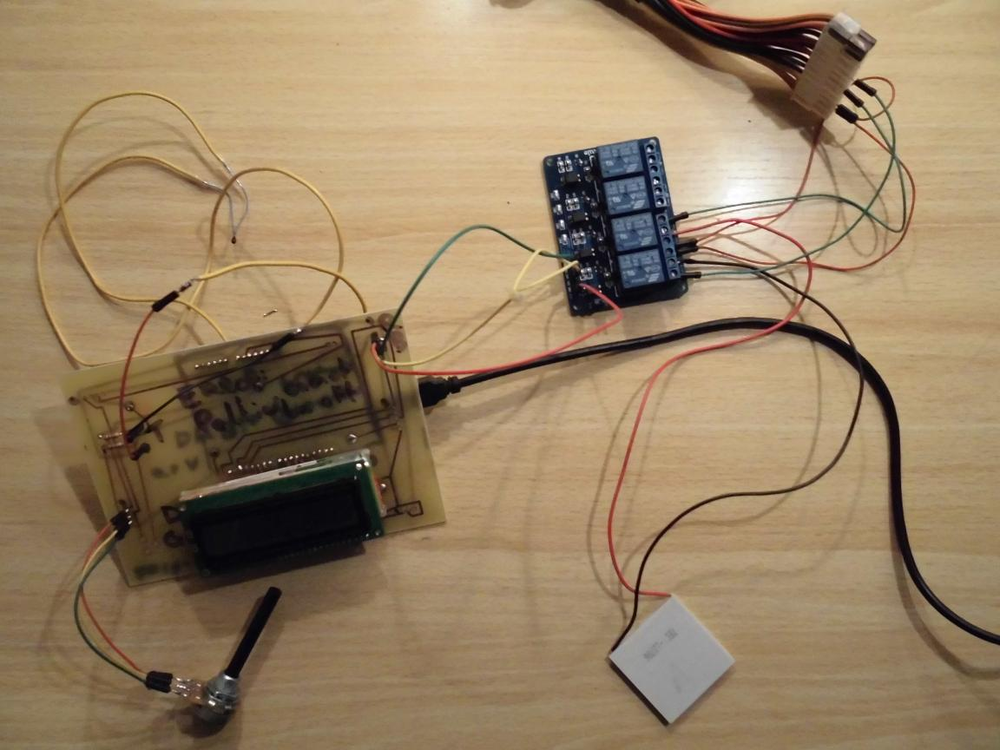
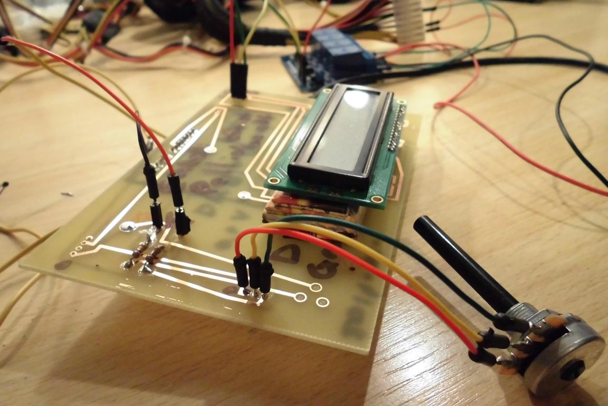

OpenerPCR is a project by DIYbio Groningen to create an open PCR machine (also called a thermocycler). OpenerPCR is inspired by the OpenPCR project.

 * [Bill of materials](bill_of_materials.md)

